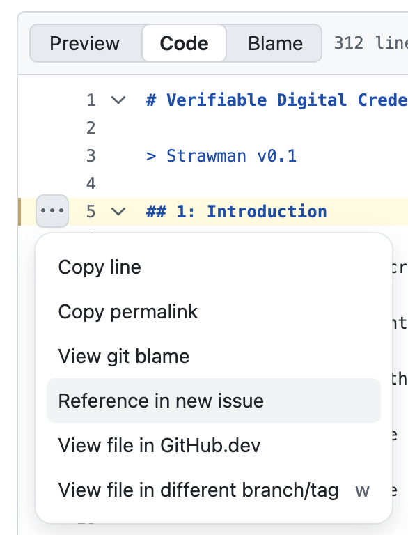

# Verifiable Digital Credentials Voluntary Code of Conduct

📄 Read the Strawman v0.1: [Document](doc.md)

💬 Provide feedback and answers to the questions here: [New Issue](https://github.com/Better-Identity-Coalition/vdc-governance-codeofconduct/issues/new?template=feedback.yml)

> [!NOTE]
> Each question in the document has a dedicated place to respond in the issue.
>
> It is recommended to open an issue in a new window, side by side with the document while reviewing.
>

To ***add comments about individual lines of text***, switch to the "Code" view (after "Preview" and before "Blame"), then click a line number, click the ellipsis, then "Reference in new issue".

🏠 [Better Identity Coalition](https://www.betteridentity.org)
